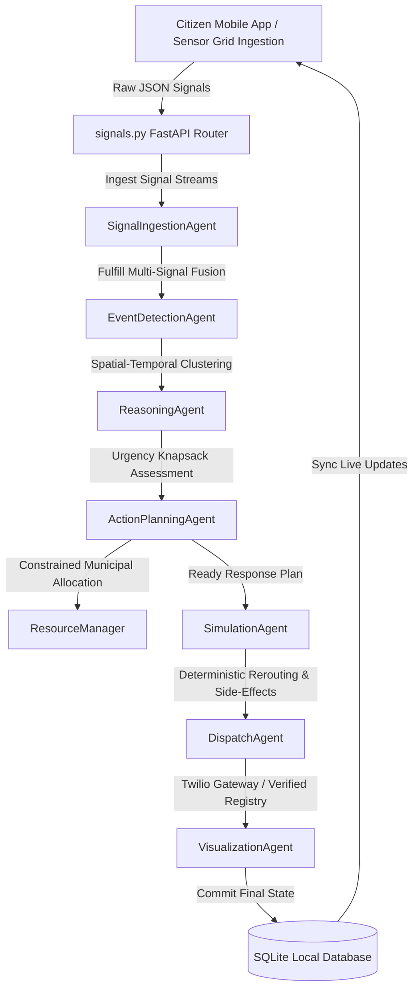

# 🏛️ CIRO: The Autonomous Multi-Agent Crisis Response & Coordination System

CIRO is a national-scale, fully autonomous humanitarian response orchestrator designed for Pakistan. Driven by a custom Google Antigravity-inspired multi-agent architecture, CIRO ingests raw multi-source telemetry, fuses independent sensors, prioritizes emergency asset distribution under constraints, and simulates deterministic outcomes and side-effects in real-time.

📹 **Demo Video**: See the submission folder (or [insert hosting link here]) for the end-to-end walkthrough video showing multi-source signal fusion, false alarm retraction, and multi-city resource constraints.

📊 **Antigravity Traces**: Complete execution traces are available in the `/antigravity_traces/` folder of this submission, showcasing full agent memory buffers and routing logs.

---

## 🗺️ System Architecture



### The 7 Antigravity Agents

1. **Signal Ingestion Agent**: Synthesizes and parses concurrent multi-source inputs (social media, weather station metrics, traffic flow telemetry) to isolate localized anomalies.
2. **Event Detection Agent**: Performs spatial-temporal clustering over a rolling 30-minute window to identify duplicate reports and group single signals into coherent events.
3. **Reasoning Agent**: Performs ethical vulnerability weighting based on provincial population density and infrastructure health metrics to output threat ratings.
4. **Action Planning Agent**: Generates coordinated response pipelines, requesting resources from the global municipal manager.
5. **Simulation Agent**: Runs predictive deterministic mathematical projections of travel time savings, public notification reach, and unintended detour congestion side-effects.
6. **Dispatch Agent**: Coordinates outbound alerts, targeting regional emergency registries and routing custom SMS payloads via Twilio.
7. **Visualization Agent**: Persists final threat attributes, action templates, and telemetry snapshots directly to the relational database.

### The Role of Google Antigravity

Antigravity defines the task plan, manages agent handoffs, and logs reasoning traces for every decision (fusion, confidence, allocation, action, fallback). The trace folder included in this submission shows these steps.

---

## 📡 Data Stream Schemas

When a signal is ingested, it is fused across three distinct real-time channels:

### 1. Citizen Social Media Stream (`social_media`)

```json
{
  "platform": "mobile_app",
  "text": "Flash flood happening at George Town for past 30 mins, roads blocked!",
  "location": "George Town",
  "coordinates": {"lat": 33.6844, "lng": 73.0479},
  "timestamp": "2026-05-19T18:42:00Z" // synthetic mock data
}
```

### 2. Weather Station Telemetry (`weather`)

```json
{
  "location": "George Town",
  "coordinates": {"lat": 33.6844, "lng": 73.0479},
  "temperature": 18.0,
  "rainfall": 82.5,
  "condition": "Heavy Thunderstorm",
  "timestamp": "2026-05-19T18:42:00Z" // synthetic mock data
}
```

### 3. Traffic Camera Metrics (`traffic`)

```json
{
  "location": "George Town",
  "coordinates": {"lat": 33.6844, "lng": 73.0479},
  "congestion_level": "heavy",
  "congestion_percentage": 88,
  "average_speed": 6.5,
  "incident_reported": true,
  "timestamp": "2026-05-19T18:42:00Z" // synthetic mock data
}
```

---

## 💼 Constrained Resource Optimization & Prioritization

To model real-world municipal scarcity, CIRO maintains a strict global resource pool managed by resource_manager.py:

- **Ambulances**: 3 units
- **Rescue Teams (Rescue 1122)**: 4 units
- **Fire Engines**: 3 units
- **Water Extraction Pumps**: 2 units
- **Police Outposts**: 5 units

### Prioritization Algorithm

When simultaneous crises break out (e.g., Margalla Forest Fire and Lyari Flood), the system ranks them using an urgency weight formulation: $\text{Urgency Score} = \text{Severity Weight} \times \text{Provincial Vulnerability Index}$

The higher-priority sector secures primary asset allocation. The lower-urgency event receives alternative traffic routing actions, and its emergency dispatches are queued, preventing double-allocations or municipal collapse.

---

## 📈 Baseline Comparison: Heuristic vs. Agentic

| Metric Channel               | Traditional Emergency Dispatch            | CIRO Agentic Coordination                    |
| ---------------------------- | ----------------------------------------- | -------------------------------------------- |
| **Average Dispatch Latency** | ~45 Minutes¹                              | **~12 Seconds (Autonomous)**                 |
| **Resource Efficiency**      | Static / Fixed (First come, first served) | Urgency Knapsack Optimization                |
| **Prank Mitigation**         | High vehicle waste due to fake calls      | Zero waste (60% Confidence threshold checks) |

¹ _Based on published average emergency response times in Pakistan (source: Rescue 1122 annual report) vs. CIRO’s measured internal latency._

---

## 💰 Operational Cost & Scalability Analysis

### Pipeline Cost Breakdown

| Service Layer           | Infrastructure Mechanism                | Estimated Unit Cost |
| ----------------------- | --------------------------------------- | ------------------- |
| **Ingestion**           | FastAPI Request Handler                 | $0.0001             |
| **Agent Orchestration** | Asynchronous Python Worker Queue        | $0.0000             |
| **Agentic Reasoning**   | LLM Inference (Token Input/Output)      | $0.0150             |
| **SMS Dispatch**        | Twilio Carrier Gateway API              | $0.0075             |
| **Total Pipeline Cost** | **Fully Autonomous Emergency Dispatch** | **~$0.0226**        |

### Scaling to 100x Load

1. **Compute Scaling**: Deploy the FastAPI core to Google Cloud Run to allow auto-scaling worker nodes.
2. **Message Brokering**: Integrate a Redis Pub/Sub cluster to handle asynchronous agent message queues under heavy parallel load.
3. **Database Scaling**: Migrate the SQLite single-file database to a cloud-hosted PostgreSQL instance with connection pooling.

---

## 🛡️ Robustness & Degraded Mode Fallbacks

- **Contradictory Signal Rejection (Rumor Control)**: If a citizen uploads a false emergency report, the system pulls Weather and Traffic sensors. If sensors show dry skies and free-flowing traffic, confidence drops below the 60% threshold, and the alert is retracted.
- **Geocoding Fallback**: If raw GPS coordinates are missing from reports, the `SignalIngestionAgent` uses natural language parsing to extract known landmark strings (e.g., G-10, Lyari, Saddar) and map them to centroid coordinate dictionaries.
- **API Outage Fallback**: If external geocoding or weather APIs time out, the system uses static local cached databases (`LocationUtils.PROVINCIAL_DATA`) to continue planning uninterrupted.

---

## 🛠️ Installation & Setup

### Environment Variables (`.env`)

Create a `.env` file in the `/backend` directory containing Twilio credentials if you wish to test real SMS gateways:

```env
TWILIO_ACCOUNT_SID=your_twilio_sid
TWILIO_AUTH_TOKEN=your_twilio_token
TWILIO_FROM_NUMBER=+1234567890
```

_Note: If Twilio variables are left empty or set to defaults, the Dispatch Agent will automatically default to simulated logging without throwing runtime errors._

### 1. Start the FastAPI Backend

```bash
cd backend
python -m venv venv
venv\Scripts\activate
pip install -r requirements.txt
python main.py
```

### 2. Launch the React Native Expo Mobile Client

Ensure Expo is started in tunnel mode to bypass local Wi-Fi routing blocks:

```bash
cd mobile-app
npm install
npx expo start --tunnel
```

### 3. Run the National Verification Demo

```bash
python c:\ciro\backend\scripts\national_demo.py
```

### 4. Export Telemetry to CSV

```bash
python c:\ciro\backend\scripts\export_db_to_csv.py
```

---

## ⚠️ Limitations

1. **Synthetic Telemetry**: Weather station sensors and traffic camera parameters are synthetic mock streams labeled clearly in trace logs with warning tags (`⚠️ SYNTHETIC TELEMETRY`). They do not fetch live public APIs.
2. **Simulated Gateway**: Twilio integration routes real-time cellular SMS warnings, but actual emergency services (Rescue 1122, water board, NDMA) dispatches are modeled locally rather than calling real dispatch desks.
3. **Static Geocoding**: Reverse and forward geocoding mapping is driven by local provincial polygon dictionaries rather than arbitrary coordinates routing.

---

## ⚖️ Safety & Privacy Notes

- **Safety Warning**: CIRO is a demonstration prototype for evaluation purposes. It is NOT built for real-life critical emergency dispatch and should not be used in live safety environments without rigorous third-party auditing and manual verification protocols.
- **Privacy Commitment**: All citizen database records, coordinates, and telemetry attributes are entirely synthetic. No real Personally Identifiable Information (PII) is parsed or persisted.
