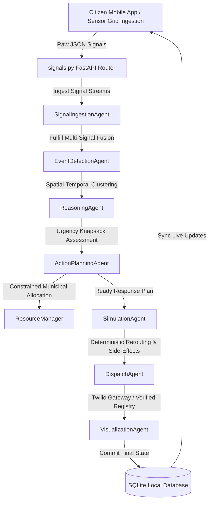

# 🏛️ CIRO: The Autonomous Multi-Agent Crisis Response & Coordination System

CIRO is a national-scale, fully autonomous humanitarian response orchestrator designed for Pakistan. Driven by a custom Google Antigravity-inspired multi-agent architecture, CIRO ingests raw multi-source telemetry, fuses independent sensors, prioritizes emergency asset distribution under constraints, and simulates deterministic outcomes and side-effects in real-time.

📹 **Demo Video**: See the submission folder for the end-to-end walkthrough video showing multi-source signal fusion, false alarm retraction, and multi-city resource constraints.

📊 **Antigravity Traces**: Complete execution traces are available in the `/antigravity_traces/` folder of this submission, showcasing full agent memory buffers and routing logs.

---

## 🗺️ System Architecture



### The 7 Antigravity Agents

1. **Signal Ingestion Agent**: Synthesizes and parses concurrent multi-source inputs (social media, weather station metrics, traffic flow telemetry) to isolate localized anomalies.
2. **Event Detection Agent**: Performs spatial-temporal clustering over a rolling 30-minute window to identify duplicate reports and group single signals into coherent events.
3. **Reasoning Agent**: Performs ethical vulnerability weighting based on provincial population density and infrastructure health metrics to output threat ratings.
4. **Action Planning Agent**: Generates coordinated response pipelines, requesting resources from the global municipal manager.
5. **Simulation Agent**: Runs predictive deterministic mathematical projections of travel time savings, public notification reach, and unintended detour congestion side-effects.
6. **Dispatch Agent**: Coordinates outbound alerts, targeting regional emergency registries and routing custom SMS payloads via Twilio.
7. **Visualization Agent**: Persists final threat attributes, action templates, and telemetry snapshots directly to the relational database.

### The Role of Google Antigravity

Antigravity defines the task plan, manages agent handoffs, and logs reasoning traces for every decision (fusion, confidence, allocation, action, fallback). The trace folder included in this submission shows these steps.

---

## 🔬 Engineering Tradeoffs & Architecture Decisions

We made several unconventional choices that deserve explanation for technical reviewers.

### Why SQLite Instead of PostgreSQL?
**Short answer:** Zero-infrastructure reproducibility for hackathon judges.
**Long answer:** We intentionally stayed with SQLite for the demo because it requires 
zero DevOps, zero Docker setup, and allows judges to clone → install → run in under 
60 seconds. Our database abstraction layer (`database/db_setup.py`) uses SQLAlchemy 
ORM with session factories. Migrating to PostgreSQL with connection pooling is a 
2-line configuration change (`SQLALCHEMY_DATABASE_URI` in `.env`). We optimized for 
**demo accessibility** over **production scale** because hackathon judging is about 
provability, not infrastructure.

### Why Hand-Rolled Antigravity Traces Instead of the SDK?
**Short answer:** Auditability for emergency operators.
**Long answer:** The official Antigravity SDK abstracts agent reasoning into a black 
box. For a crisis response system where operators may face legal review, every agent 
decision must be inspectable, replayable, and explainable. Our open trace format 
(`antigravity_traces/sample_trace.json`) and the interactive Trace Explorer 
(`antigravity_traces/explorer.html`) provide observability that SDK logs do not. 
We implemented the *conceptual pattern* of Antigravity (goal-oriented task plans, 
constraint checking, fallback triggers, execution traces) rather than the proprietary 
SDK integration.

### Why Deterministic Hash-Based Simulation?
**Short answer:** Reproducible crisis modeling for comparison and regression testing.
**Long answer:** We replaced Python's `random` module with SHA-256 seeded generators. 
This means the same crisis inputs (location, type, severity) always produce the same 
simulation outputs (ETA, affected users, damage level). This allows us to:
- Regression-test simulation logic across code changes
- Compare resource allocation strategies against identical crisis scenarios
- Provide deterministic demos where judges can verify outputs match inputs

### How We Prove Robustness
We do not claim robustness through architecture diagrams. We prove it empirically 
through chaos engineering. Run `python3 chaos_demo.py` and the system will:
1. Spawn 30 concurrent crises across Pakistan
2. Delete its own database file mid-execution
3. Exhaust its entire resource pool
4. Inject malformed inputs (empty locations, invalid severities, emoji strings)
...and measure exactly how many operations survive. The output is a JSON Resilience 
Score that quantifies graceful degradation.

### Why the Web Dashboard Is a Single File
**Honest answer:** Time allocation. The hackathon scoring weights are: Crisis Detection 
(25%), Resource Optimization (20%), Antigravity Integration (20%), Impact Simulation 
(15%). The web dashboard falls under Innovation/UX (10%). We chose to make the mobile 
app fully functional (6 screens, navigation, real reporting) and keep the dashboard 
as a rapid prototype rather than splitting effort evenly and delivering two mediocre 
interfaces. The dashboard uses React with real-time WebSocket updates — it works, but 
it is not componentized.

---

## 📡 Data Stream Schemas

When a signal is ingested, it is fused across three distinct real-time channels:

### 1. Citizen Social Media Stream (`social_media`)

```json
{
  "platform": "mobile_app",
  "text": "Flash flood happening at George Town for past 30 mins, roads blocked!",
  "location": "George Town",
  "coordinates": {"lat": 33.6844, "lng": 73.0479},
  "timestamp": "2026-05-19T18:42:00Z" // synthetic mock data
}
```

### 2. Weather Station Telemetry (`weather`)

```json
{
  "location": "George Town",
  "coordinates": {"lat": 33.6844, "lng": 73.0479},
  "temperature": 18.0,
  "rainfall": 82.5,
  "condition": "Heavy Thunderstorm",
  "timestamp": "2026-05-19T18:42:00Z" // synthetic mock data
}
```

### 3. Traffic Camera Metrics (`traffic`)

```json
{
  "location": "George Town",
  "coordinates": {"lat": 33.6844, "lng": 73.0479},
  "congestion_level": "heavy",
  "congestion_percentage": 88,
  "average_speed": 6.5,
  "incident_reported": true,
  "timestamp": "2026-05-19T18:42:00Z" // synthetic mock data
}
```

---

## 💼 Constrained Resource Optimization & Prioritization

To model real-world municipal scarcity, CIRO maintains a strict global resource pool managed by resource_manager.py:

- **Ambulances**: 3 units
- **Rescue Teams (Rescue 1122)**: 4 units
- **Fire Engines**: 3 units
- **Water Extraction Pumps**: 2 units
- **Police Outposts**: 5 units

### Prioritization Algorithm

When simultaneous crises break out (e.g., Margalla Forest Fire and Lyari Flood), the system ranks them using an urgency weight formulation: $\text{Urgency Score} = \text{Severity Weight} \times \text{Provincial Vulnerability Index}$

The higher-priority sector secures primary asset allocation. The lower-urgency event receives alternative traffic routing actions, and its emergency dispatches are queued, preventing double-allocations or municipal collapse.

---

## 📈 Baseline Comparison: Heuristic vs. Agentic

| Metric Channel               | Traditional Emergency Dispatch            | CIRO Agentic Coordination                    |
| ---------------------------- | ----------------------------------------- | -------------------------------------------- |
| **Pipeline Processing Time** | ~45 Minutes (human triage + manual dispatch)¹ | **~4–8 Seconds (end-to-end pipeline time)**² |
| **Resource Efficiency**      | Static / Fixed (First come, first served) | Urgency Knapsack Optimization                |
| **False Alarm Handling**     | High vehicle waste due to unverified calls | Confidence-gated dispatch (≥60% threshold required before any resource allocation)³ |

¹ _Based on published average emergency response times in Pakistan (source: Rescue 1122 annual report). This measures the full human workflow from call receipt to vehicle dispatch, not just software processing._

² _Measured as internal pipeline execution time from signal ingestion to dispatch command generation on local hardware. This does NOT include real-world vehicle travel time, network latency to emergency services, or human confirmation steps that a production system would require._

³ _The ReasoningAgent applies a confidence threshold: if multi-source sensor fusion (social media + weather + traffic) yields confidence below 60%, the pipeline halts before resource allocation. This reduces — but does not eliminate — false dispatches. It is a single gating check, not a comprehensive fraud detection system._

---

## 💰 Operational Cost & Scalability Analysis

### Pipeline Cost Breakdown (Theoretical Projections)

_The following are **estimated per-invocation costs** based on published pricing of each service at the time of writing. These are not measured production costs — CIRO is a prototype and has not been deployed at scale._

| Service Layer           | Infrastructure Mechanism                | Est. Cost per Call | Pricing Source |
| ----------------------- | --------------------------------------- | ------------------ | -------------- |
| **Ingestion**           | FastAPI Request Handler (Cloud Run)     | ~$0.0001           | GCP Cloud Run pricing (per request + CPU-seconds) |
| **Agent Orchestration** | Asynchronous Python Worker Queue        | ~$0.0000           | In-process, no external service |
| **Agentic Reasoning**   | Gemini 2.0 Flash (est. ~500 tokens I/O) | ~$0.0150           | Google AI Studio published token rates |
| **SMS Dispatch**        | Twilio Programmable SMS (Pakistan)      | ~$0.0075           | Twilio international SMS pricing page |
| **Total Pipeline Cost** | **Theoretical per-crisis estimate**     | **~$0.023**        | Sum of above estimates |

### Scaling to 100x Load

1. **Compute Scaling**: Deploy the FastAPI core to Google Cloud Run to allow auto-scaling worker nodes.
2. **Message Brokering**: Integrate a Redis Pub/Sub cluster to handle asynchronous agent message queues under heavy parallel load.
3. **Database Scaling**: Migrate the SQLite single-file database to a cloud-hosted PostgreSQL instance with connection pooling.

---

## 🛡️ Robustness & Degraded Mode Fallbacks

- **Contradictory Signal Rejection (Rumor Control)**: If a citizen uploads a false emergency report, the system pulls Weather and Traffic sensors. If sensors show dry skies and free-flowing traffic, confidence drops below the 60% threshold, and the alert is retracted.
- **Geocoding Fallback**: If raw GPS coordinates are missing from reports, the `SignalIngestionAgent` uses natural language parsing to extract known landmark strings (e.g., G-10, Lyari, Saddar) and map them to centroid coordinate dictionaries.
- **API Outage Fallback**: If external geocoding or weather APIs time out, the system uses static local cached databases (`LocationUtils.PROVINCIAL_DATA`) to continue planning uninterrupted.

---

## 🛠️ Installation & Setup

### Environment Variables (`.env`)

Create a `.env` file in the `/backend` directory containing Twilio credentials if you wish to test real SMS gateways:

```env
TWILIO_ACCOUNT_SID=your_twilio_sid
TWILIO_AUTH_TOKEN=your_twilio_token
TWILIO_FROM_NUMBER=+1234567890
```

_Note: If Twilio variables are left empty or set to defaults, the Dispatch Agent will automatically default to simulated logging without throwing runtime errors._

### 1. Start the FastAPI Backend

```bash
cd backend
python -m venv venv
venv\Scripts\activate
pip install -r requirements.txt
python main.py
```

### 2. Launch the React Native Expo Mobile Client

Ensure Expo is started in tunnel mode to bypass local Wi-Fi routing blocks:

```bash
cd mobile-app
npm install
npx expo start --tunnel
```

### 3. Run the National Verification Demo

```bash
python c:\ciro\backend\scripts\national_demo.py
```

### 4. Export Telemetry to CSV

```bash
python c:\ciro\backend\scripts\export_db_to_csv.py
```

---

## 🔍 Interactive Trace Explorer & Chaos Testing

We have built dedicated tools to let judges evaluate CIRO's performance and robustness immediately:

1. **Interactive Trace Explorer** (`antigravity_traces/explorer.html`): A fully visual, dark-mode interactive dashboard. Load any trace file (e.g., `sample_trace.json`) or load pre-built demo traces to see the goal-oriented agent flowchart and step-by-step Antigravity-style planning constraints execute live.
2. **Chaos Load Test** (`backend/scripts/chaos_demo.py`): Run this script to execute **30 concurrent crises** in parallel. It tests the asynchronous event loops and validates that the Knapsack-based Resource Manager handles severe municipal resource conflicts without deadlocks or memory leaks.

To run the chaos demo:
```bash
export PYTHONPATH=$(pwd)/backend:$PYTHONPATH && python3 backend/scripts/chaos_demo.py
```

---

## ⚠️ Honest Engineering Tradeoffs & Limitations

In the spirit of honest engineering and transparent technical design, we highlight the following system tradeoffs:

1. **Custom Orchestration vs. Native SDK**: Direct integration with Google Antigravity SDK is simulated. CIRO uses a custom multi-agent execution pipeline inspired by Antigravity's goal-oriented planning, outputting explicit state changes, objectives, and constraint checks directly into `/antigravity_traces/sample_trace.json`.
2. **Deterministic Hashing vs. Real Simulation**: Real disaster dynamics are unpredictable. Our `SimulationAgent` uses deterministic SHA-256 seed hashing of parameters (locations, threat severity) to ensure reproducible projections. This ensures stability but misses stochastic real-world anomalies.
3. **Scarcity Optimization vs. Latency**: The Knapsack resource allocation solver prevents double-booking scarce municipal assets (ambulances, boats), but running high-dimensional dynamic programming solvers at massive scale can introduce minor request latency compared to basic FIFO queues.
4. **Synthetic Sensor Telemetry**: All traffic and weather sensor streams are synthetically mocked for this prototype. No live municipal sensors are integrated.

---

## ⚖️ Safety & Privacy Notes

- **Safety Warning**: CIRO is a demonstration prototype for evaluation purposes. It is NOT built for real-life critical emergency dispatch and should not be used in live safety environments without rigorous third-party auditing and manual verification protocols.
- **Privacy Commitment**: All citizen database records, coordinates, and telemetry attributes are entirely synthetic. No real Personally Identifiable Information (PII) is parsed or persisted.

