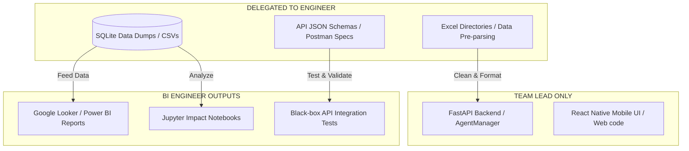

# CIRO Team Lead Guide: Secure Delegation for BI Analytics & Software Engineers

As a Team Lead keeping strict control over your proprietary AI Agent codebase, you can leverage a **"Black-Box Delegation"** strategy. This allows your BI / Software Engineer to deliver high-value work (data pipeline validation, interactive analytics, API testing, and schemas) using isolated sandboxes without ever seeing your agentic source files.

---

## 🏗️ The "Black-Box" Collaboration Model

Instead of granting access to the core React Native/FastAPI repository, you divide the system into **Inputs**, **Outputs**, and **Analytics** layers:



---

## 📋 Recommended Tasks to Assign

### Task 1: Standalone BI Dashboarding & Analytics (BI Role)
* **Objective**: Build an interactive municipal intelligence dashboard using BI tools (Google Looker Studio, Power BI, or Tableau) to analyze simulated crisis reports.
* **How to Delegate**: 
  1. Export a snapshot of the SQLite database (`crisis_response.db`) or dump the tables (`crises`, `dispatch_records`, `signals`) into CSV files.
  2. Send these data files to the engineer.
  3. Ask them to design administrative reports tracking:
     * **Response KPI**: Time from report submission to dispatch across regions.
     * **Severity Hotspots**: Spatial distribution of critical vs. low-level situations.
     * **Impact Simulation**: A dashboard showcasing "Before vs. After" lives protected using historical dispatch trends.
* **Why it keeps you in control**: The BI tool connects directly to the static data dumps, meaning they require zero access to your application server.

---

### Task 2: Standalone Excel Pre-parsing & Schema Sanitization (Software Engineering Role)
* **Objective**: Write an offline Python utility script to parse, clean, and validate emergency contacts from spreadsheets (such as `CIRO_Emergencies_contact_details.xlsx`) before the backend ingests them.
* **How to Delegate**:
  1. Share the raw Excel emergency contact details sheet.
  2. Define the desired JSON output schema format:
     ```json
     { "agency_key": { "name": "", "emoji": "", "numbers": { "City": "number" } } }
     ```
  3. Task them to write a single standalone Python script using `pandas` and `openpyxl` to parse and output a structured `contacts_registry.json`.
* **Why it keeps you in control**: They only see a raw spreadsheet and output a JSON file, which you can easily drag-and-drop into your `/backend/agents/` folder once approved.

---

### Task 3: API Black-Box Testing & Postman Collection (Software Engineering Role)
* **Objective**: Build an automated integration test collection using Postman or a standalone script to perform QA tests against the backend endpoints.
* **How to Delegate**:
  1. Send them the backend API document list or JSON endpoints list (e.g., `/api/signals/ingest`, `/api/crises/active`).
  2. Ask them to build a **Postman Collection** with test assertions verifying response codes (`200 OK`, `400 Bad Request`), header validity, and latency limits.
* **Why it keeps you in control**: They only interact with your backend as an external HTTP client, verifying the product's behavior without seeing the logic behind it.

---

### Task 4: Standalone Simulated Data Generator (Software Engineering Role)
* **Objective**: Build an offline stress-test script that generates hundreds of random emergency signals (geo-coordinates, platform texts, traffic telemetry) to stress-test database indexing.
* **How to Delegate**:
  1. Provide the input JSON schema expected by `/api/signals/ingest`.
  2. Ask them to write a standalone Python generator using library `Faker` to output random, realistic mock signals matching the schema.
* **Why it keeps you in control**: They generate simulation tooling externally. You run the tool against your system to demonstrate its scalability.

---

## 🛠️ Step-by-Step Leadership Workflow

1. **Step 1: Interface Isolation**: Create a shared directory (e.g., a shared Google Drive or Git repository containing only Excel contacts, schema templates, and SQLite database snapshots).
2. **Step 2: Task Definition**: Assign one of the tasks above, providing clear inputs (CSVs/Excel) and exact expected outputs (JSON files, BI URLs, or Postman exports).
3. **Step 3: Verification & Integration**: Once they submit the work:
   * Verify the BI Dashboard link or run the Postman collection against your local server.
   * If they wrote a Python script (like a contacts parser or a mock data generator), inspect the file, and copy it into your proprietary repository yourself.
